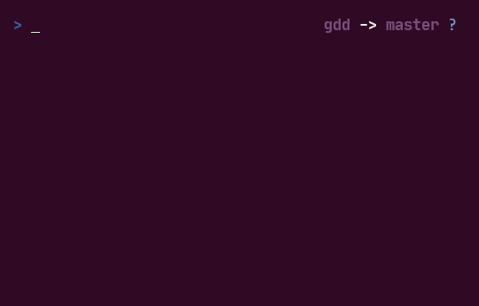

# GDD
A simple tool to solve a pain in the ass when you want to add some files to stage, but not all.

# How to install

```
sudo sh -c "$(curl -sSL https://raw.githubusercontent.com/kirevdokimov/gdd/master/install.sh)"
```
# How to use

```
Arrows up/down to navigate
Space to mark and unmark
Enter to apply and exit
q to exit with no apply
```

# How to uninstall

```
sudo rm /usr/local/bin/gdd
```
